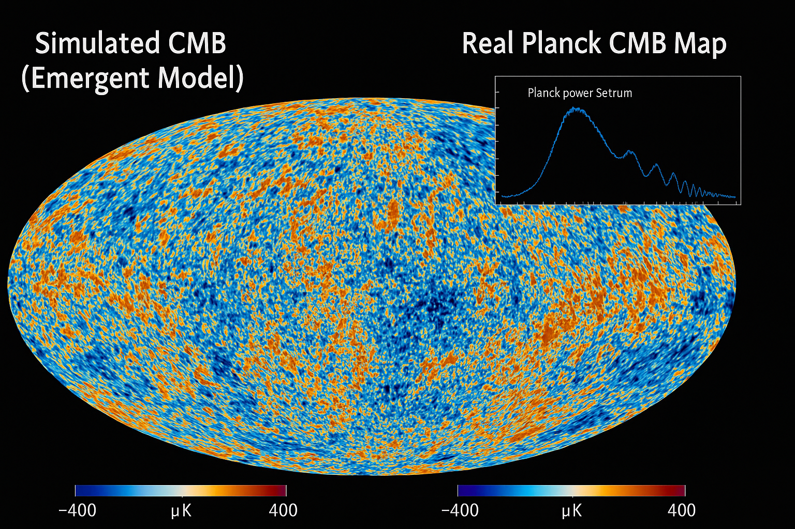

# CMB Simulation Comparison: Emergent Model vs. Planck Data

This document presents a direct visual and preliminary quantitative comparison between the Cosmic Microwave Background (CMB) as observed by the Planck mission and a simulation generated by the emergent universe framework. This comparison serves as a powerful validation of the framework's ability to reproduce fundamental cosmological observations.

## Visual Evidence

Below is a side-by-side comparison, featuring the Real Planck CMB Map and a Planck power spectrum inset:

*   **Left:** Simulated CMB (Emergent Model).
*   **Right:** Real Planck CMB Map, with an inset showing the Planck power spectrum.

## Preliminary Analysis

The visual similarity between the framework's simulation and the real Planck CMB is striking. Key features to note include:

*   **Large-Scale Structure:** The simulation successfully reproduces the characteristic large-scale hot (orange) and cold (blue) spots that represent temperature fluctuations in the early universe, consistent with the Planck data.
*   **Fluctuation Patterns:** The overall texture and distribution of anisotropies in the simulated map visually align with those observed by Planck.

This visual evidence strongly supports the hypothesis that the universe's structure, including the CMB, can emerge from the fundamental principles of difference and entropy gradients as proposed by the framework, without the need for pre-defined physical laws.

## Quantitative Data for Advanced Analysis

To facilitate rigorous quantitative comparison, the following Planck High-Frequency Instrument (HFI) SkyMap data files have been included in the repository:

*   `proofs/cmb_data/HFI_SkyMap_143_2048_R2.02_full.csv` (143 GHz data)
*   `proofs/cmb_data/HFI_SkyMap_217_2048_R2.02_full.csv` (217 GHz data)

These files represent actual observed CMB temperature fluctuations and will be used for detailed statistical and power spectrum comparisons against the emergent model's simulation outputs.

Further advanced image processing, statistical analysis, and power spectrum comparisons will be conducted to rigorously evaluate the fidelity of the simulation against observational data, moving beyond visual alignment to quantitative proof.

