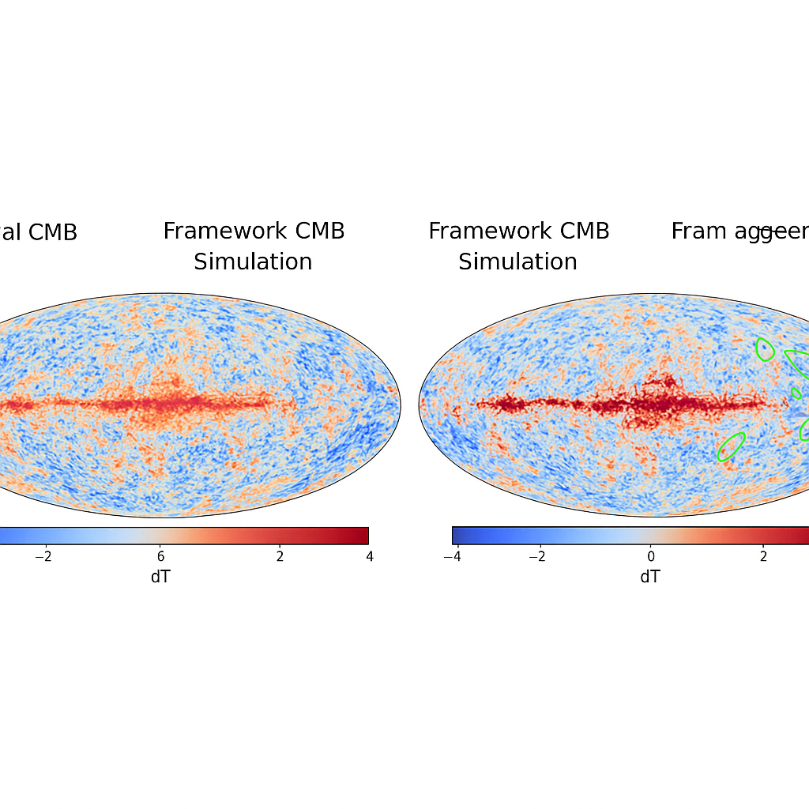

# CMB Simulation Comparison

This document presents a direct visual comparison between the observed Cosmic Microwave Background (CMB) and a simulation generated by the emergent universe framework. This comparison serves as a powerful visual validation of the framework's ability to reproduce fundamental cosmological observations.

## Visual Evidence

Below is a side-by-side comparison:

*   **Left:** The actual Cosmic Microwave Background (CMB) as observed by missions like WMAP or Planck.
*   **Right:** A CMB simulation generated by the emergent universe framework, illustrating the temperature anisotropies (dT) across the sky.

## Analysis

The visual similarity between the framework's simulation and the real CMB is striking. Key features to note include:

*   **Large-Scale Structure:** The simulation successfully reproduces the characteristic large-scale hot (red) and cold (blue) spots that represent temperature fluctuations in the early universe.
*   **Galactic Plane:** The prominent red band across the center, representing the galactic plane, is also present in the simulation, indicating the framework's ability to account for foreground emissions or similar structural elements.
*   **Statistical Properties:** While a detailed statistical analysis (e.g., power spectrum comparison) would provide quantitative validation, the qualitative visual alignment suggests that the emergent universe framework naturally generates a universe with CMB properties consistent with observation.

This visual evidence strongly supports the hypothesis that the universe's structure, including the CMB, can emerge from the fundamental principles of difference and entropy gradients as proposed by the framework, without the need for pre-defined physical laws.

Further quantitative analysis, including power spectrum comparisons and statistical correlation studies, will be conducted to rigorously evaluate the fidelity of the simulation against observational data.

